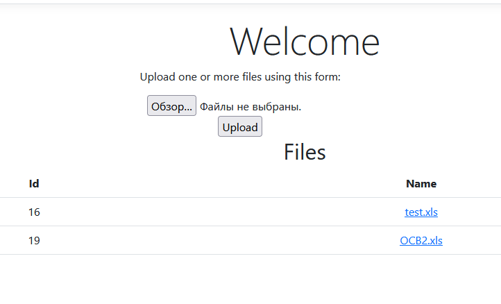

# Демострация работы

Для базы данных выделил 4 связанных сущности:
1. Файл
2. Лист файла
3. Классы на листе
4. Данные в классе

Остальные данные не попадают в таблицу

Перед демострацией файл был изменен, чтобы был еще один лист

Стартовая страница:

Загружаем:

Нажимаем на название файла и попадаем страцу с сохраненными данными из файла  
просмотр по страницам и по классам

